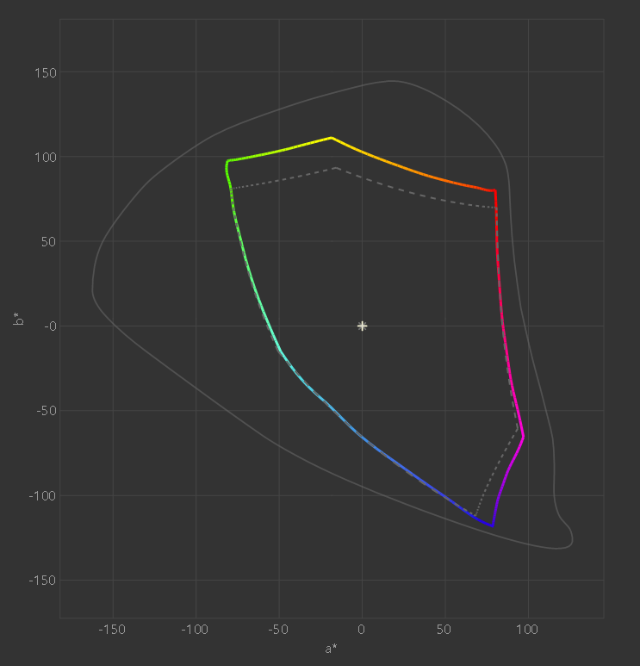

# Wpf Managed Colors

Color Managed WPF Demonstration app based on the nuget library [Mscms](https://www.nuget.org/packages/Mscms.WPF)

Colors displayed by WPF applications are not color managed, this library fills the gap by integrating the WCS (Windows Color System) introduced by Windows Vista.

The first step for accurate colors is to calibrate the monitor with a calibration software (ex. DisplayCal) and device (manufacturer ex. Calibrite, Datacolor, etc..). A Color Profile for your monitor will be installed.

As an example the Color Profile may contains data to map the sRGB color (255,0,0) to the value RGB (240,0,0) if you monitor is able to display a RED that is more saturated than the RED defined by the sRGB standard.

After this step color-managed apps (ex. Photoshop) can use the installed Color Profile to display accurate colors.

What about other apps? They show partially corrected colors because only some corrections (ex. Gamma Curve 1D LUT) are loaded into the GPU and OS-independent.

## Why Windows Color System?

Because WCS is integrated in the OS and supports advanced Color Profiles containing LUTs, Matrix, etc.. that other Color Engines (for ex. the one used by Gimp) are not able to fully process. [LittleCMS](https://www.littlecms.com) is a common alternative for C/C++ softwares.

## How this library works?

The whole app is not automatically color-managed because there is no usually need for this. Only images or specific parts need to be color-managed. To manage Colors and Images two extension methods are provided: ToManagedColor() and ToManagedImage().

```
Color managed = Color.FromRgb(248, 218, 69).ToManagedColor();
BitmapImage managedImage = new BitmapImage(..).ToManagedImage();
```

This is the simplest way to automatically translate colors with the Color Profile associated to the monitor hosting the app.

Additional classes are available to specify the Input/Output Profile, the Rendering Intent and additional options.
This application contains an Advanced example to show these classes and how to update the Color Profile if the app is moved to another monitor.

If it's best not to touch your application code, an Attached Property is available for the Image control and the SolidColorBrush class.
Can be used by simply adding the IsColorManaged property to your XAML.

```
<Image Mscms:WpfManagedColors.IsColorManaged="True" />
```

## Performance

A FullHD image (1920x1080) color correction usually takes less than 0.1s

For high-performance scenario a commercial version of the Mscms.WPF library exists and offers a GPU-accelerated color management engine, making possible to color-manage the whole app with support for real-time animations, video playback, etc.. Please contact the author if interested.

## Color Accuracy

To verify the real-world accuracy of the Mscms Color Management a Target Color was displayed and measured under different conditions.

### Calibration

| Monitor  | Calibration Hardware | Calibration Software |
| ------------- | ------------- | ------------- |
| LG 27UK650  | X-Rite ColorMunki Display  | DisplayCal 3.8.9.3  |

### CIE a\*b\* Gamut Diagram (Perceptual Rendering Intent)



### Target Color

| sRGB  | LAB D50  |
| ------------- | ------------- |
| 248 218 69  | 87.73 -0.36 72.62  |

### Experimental Results

| Monitor  | App Colors | sRGB | LAB D50 | CIE00 | CMC 1:1 |
| ------------- | ------------- | ------------- | ------------- | ------------- | ------------- |
| Uncalibrated  | Unmanaged  | 245 224 6  | 88.82 -5.67 86.44  | 4.16  | 5.43  |
| Calibrated  | Unmanaged  | 247 218 35  | 87.60 -1.51 82.00  | 2.19  | 3.18  |
| Calibrated  | Managed  | 250 219 76  | 88.24 -0.02 70.52  | 0.63  | 0.80  |

An uncalibrated monitor is showing a color difference of 4.16 using the CIE2000 comparison method. The difference is easily spotted by untrained viewers.

By calibrating the monitor some corrections are loaded in the GPU the color accuracy improves to 2.19. The difference is still spottable.

The color-managed WPF app with the calibrated monitor is showing an unperceptible color difference of 0.63. Trained viewers are usually not able to discern any difference.

Results may differ depending on the Monitor model and the Calibration, but the concept is the same.

## Demo Example - Calibrated Monitor

The Monitor is calibrated and the Color Profile is installed. In this example you can see that the Managed Yellow is slightly different to be more accurate on the used display. Colors are transformed from the Input Profile (sRGB) to the Output Profile (Monitor profile .icm)


## Demo Example - Uncalibrated Monitor

The Monitor is not calibrated and the Color Profile fallback to sRGB. Colors are not changed because Input and Output profiles are the same.


## System Requirements

The library is divided in two packages: Mscms.Core (.NET Standard 2.0) and Mscms.WPF (.NET 4.8 Framework) to support any modern .NET application.

WPF projects (including .NET 6+) should reference Mscms.WPF, while non-WPF projects (ASP.NET, UWP, MAUI, etc..) should reference the Mscms.Core library.

## Commercial License

The library [Mscms](https://www.nuget.org/packages/Mscms.WPF) is not free to use for commercial projects. Please contact (info at majinsoft .com) to obtain a commercial license, support and additional features such as GPU acceleration.